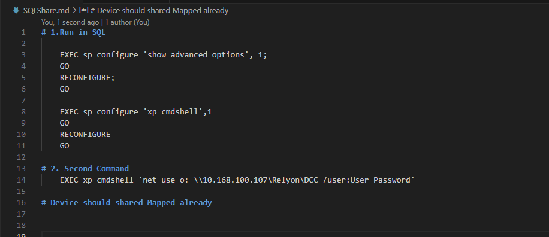

# 1.Run in SQL 

    EXEC sp_configure 'show advanced options', 1;
    GO
    RECONFIGURE;
    GO

    EXEC sp_configure 'xp_cmdshell',1
    GO
    RECONFIGURE
    GO

# 2. Second Command
    EXEC xp_cmdshell 'net use o: \\10.168.100.107\Relyon\DCC /user:User Password'

# Device should shared Mapped already

